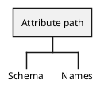
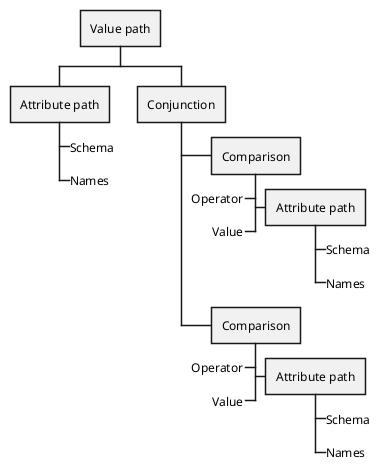

# Attribute Path

The Attribute Path is simply a path to an attribute (e.g. `name.firstName`) and implements the `AST\Path` interface. It is not considered a node and as such has no notion of where it is in the tree. 

In the [Filter Parser](../parsers.md) this means that it's never returned on its own but always as part of a [Value Path](./value-path.md) or [Comparison](./comparison.md).

The only time it will be returned by itself is when using the [Path Parser](../parsers.md).

#### Example

Take the this example where we have a Value Path with a Conjunction containing two Comparisons, which could be something like `name[givenName eq "John" and familyName sw "J"]` which translates to filter all users with a given name of "John" and a family name starting with the letter J.

The Attribute Path of the Value Path would contain only `['name']` but the Attribute Paths of the Comparisons down the tree contain the full path `['name', 'givenName']` and for the other Comparison `['name', 'familyName']`.

So even though they have no direct link to their parent node, you still have the full path, saving you from having to traverse up and down the tree or keep complex states when parsing the AST.

## Implements

* [Countable](https://www.php.net/manual/en/class.countable.php) - Count the number of names
* [Array access](https://www.php.net/manual/en/class.arrayaccess.php) - Access the names as indexed array
* [Iterator](https://www.php.net/manual/en/class.iteratoraggregate.php) - Iterate over the names directly
* [Path](./path.md) - Interface indicating that this is a path

## Methods

#### `getSchema(): string|null`
Returns the schema part of an attribute path.

#### `getNames(): string[]`

Returns an array of names (parts). For example `foo.bar` will return `['foo', 'bar']`.
