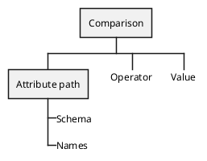

# Comparison

The Comparison is the most common AST node in filters.

#### Example

`foo eq "bar"` — translates to a Comparison node with `foo` as Attribute Path, `eq` as operator and `bar` as value.

## Implements

* Node - Base interface for all AST nodes.

## Methods

#### `getAttributePath():` [AttributePath](./attribute-path.md)
Returns the attribute path.

#### `getOperator():` [Operator](./operator.md)
Returns the operator used in the comparison, can safely be cast to string if you don't with to work with an enum object.

#### `getValue(): bool|string|int|float|null`
Returns the value part of the comparison.
