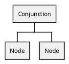

# Conjunction

#### Example

`foo eq "bar" and baz ew "S"` — translates to a Conjunction node with two [Comparison](./comparison.md) nodes.

## Implements

* Node - Base interface for all AST nodes.
* [Connective](./connective.md) - Interface for logical operations
  * [Countable](https://www.php.net/manual/en/class.countable.php) - Count the number of nodes
  * [Array access](https://www.php.net/manual/en/class.arrayaccess.php) - Access the nodes as indexed array
  * [Iterator](https://www.php.net/manual/en/class.iteratoraggregate.php) - Iterate over the nodes directly

## Methods

#### `getNodes(): Node[]`
Returns all nodes.

