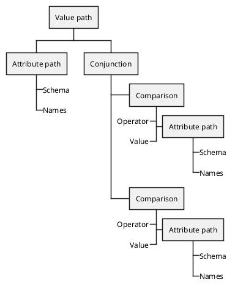

# Connective

Base interface for all logical operations. There are two types of connectives in SCIM filters, [Conjunctions (`AND`)](./conjunction.md) and [Disjunctions (`OR`)](./disjunction.md). Both implement this interface.

> In logic, a logical connective (also called a logical operator, sentential connective, or sentential operator) is a symbol or word used to connect two or more sentences (of either a formal or a natural language) in a grammatically valid way, such that the value of the compound sentence produced depends only on that of the original sentences and on the meaning of the connective. 
>
> — [Wikipedia](https://en.wikipedia.org/wiki/Logical_connective)

### Example

`name[givenName eq "John" and familyName eq "Dough"]`

### Extends

* [Countable](https://www.php.net/manual/en/class.countable.php) - Count the number of nodes
* [Array access](https://www.php.net/manual/en/class.arrayaccess.php) - Access the nodes as indexed array
* [Iterator](https://www.php.net/manual/en/class.iteratoraggregate.php) - Iterate over the nodes directly