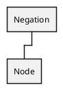

# Negation

#### Example

`not (foo eq "bar")` — translates to a Negation node with a [Comparison](./comparison.md) node.

## Implements

* Node - Base interface for all AST nodes.

## Methods

#### `getNode(): Node`
Return the negated node.
