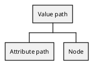

# Path

In the AST there are two types of paths:

The [Attribute Path](./attribute-path.md) is simply a path to an attribute (e.g. `name.firstName`) and implements the `AST\Path` interface as it is not a node by itself. For instance, the attribute path is part of a value path.

The [Value Path](./value-path.md) implements both the `AST\Path` and `AST\Node` interfaces and is a node by itself. It not only dictates a path to an attribute but also a set of conditions (e.g. `name[givenName eq "John"].familyName` to get all family names of people named "John").

