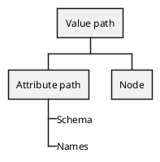
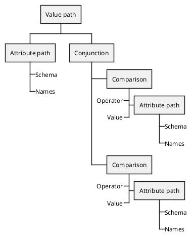

# Value Path

The Value Path is like an [Attribute Path](./attribute-path.md) but is actually a node and can be returned directly by both parsers. It hold both a path and a condition (in brackets).

When using the [Path Parser](../parsers.md), a Value Path can additionaly contain a sub attribute: `name[givenName eq "John" and familyName sw "J"].formatted` — in this case the `formatted` attribute. The Value Path's [Attribute Path](./attribute-path.md) would then have two parts (names): `['name', 'formatted']`. The `formatted` part will not appear in in [Attribute Paths](./attribute-path.md) further down the tree as it only applies to the Value Path.

#### Example

`name[givenName eq "John" and familyName sw "J"]` — which translates to filter all users with a given name of "John" and a family name starting with the letter J. The AST would look like this:

## Implements

* Node - Base interface for all AST nodes.
* [Path](./path.md) - Interface indicating that this is a path

## Methods

#### `getAttributePath():` [AttributePath](./attribute-path.md)

Returns the attribute path.

#### `getNode(): Node`

Returns the node of the condition between the brackets.